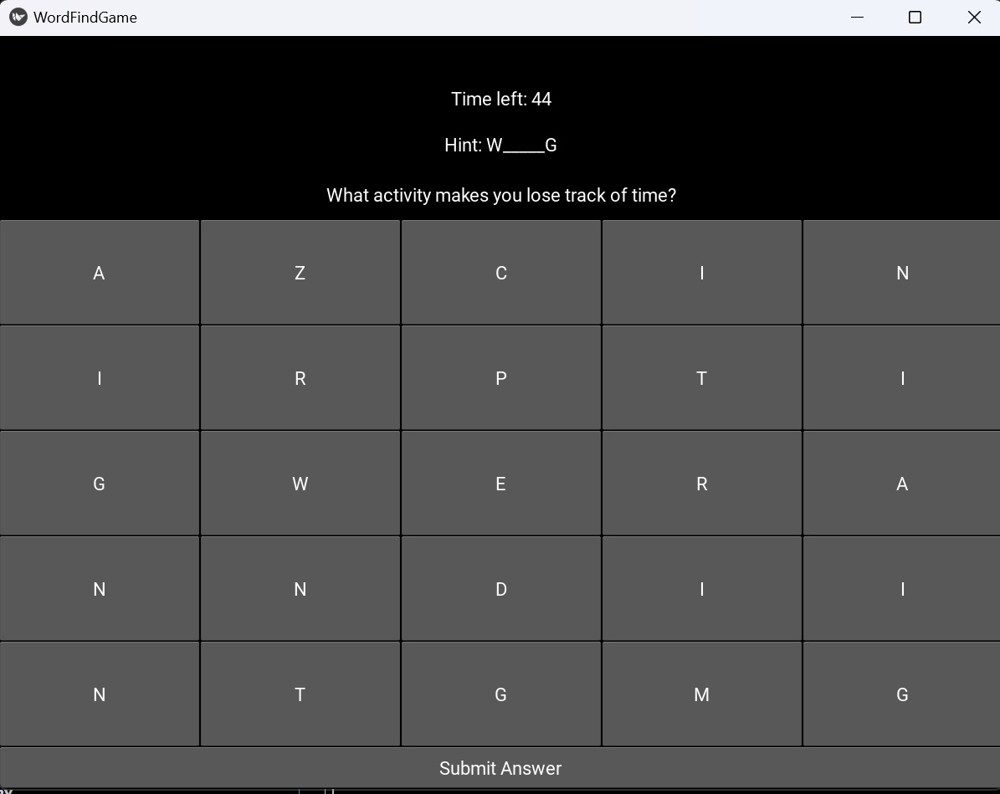

[](https://kivy.org/)

# WordFindGame - Educational Application



## Introduction
WordFindGame is a Python-based educational application designed to enhance cognitive skills and vocabulary through an engaging word-finding game. Developed with the Kivy framework, it's crafted to be a learning aid for individuals seeking to improve their language skills and emotional awareness.

## Features

- **Interactive Gameplay:** Engage with a grid of letters to find words that answer reflective questions.
- **Adaptive Difficulty:** With each correct answer, the next question and word find challenge is presented.
- **Hints System:** Get help with tricky words with a hint system that reveals the first and last letters.
- **Timer Challenge:** Improve quick-thinking skills with a timer for each question, promoting faster recall and decision-making.
- **Educational Questions:** Questions are designed to stimulate thought and discussion, promoting emotional intelligence and self-awareness.

## Game Structure

- Start with a question prompting reflection (e.g., "What makes you feel happy?")
- A grid of letters appears, from which players must form words that are answers to the question.
- Points are awarded for correct answers, and a new question appears after each success.
- Use hints if needed, revealing part of the answer to aid in learning.
- The game progresses through a series of questions, each with its own set of answers to find within the letter grid.

## How to Use in an Educational Setting

- **Language Learning:** Enhance vocabulary and spelling through practical application.
- **Cognitive Development:** Encourage pattern recognition and problem-solving as players search for words.
- **Emotional Intelligence:** Use reflective questions to allow players to connect language learning with emotional self-awareness.
- **Therapeutic Use:** Facilitate conversation in a therapeutic setting about feelings and personal experiences.
- **Classroom Tool:** Implement as a fun and interactive method for engaging students in language and emotional learning.


## Technical Setup

1. Install Python and the Kivy framework on your computer.
2. Clone or download the application source code.
3. Navigate to the project directory and run the main game file:

```bash
python WordFindGame.py
